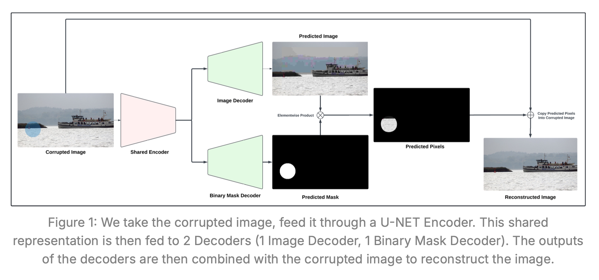
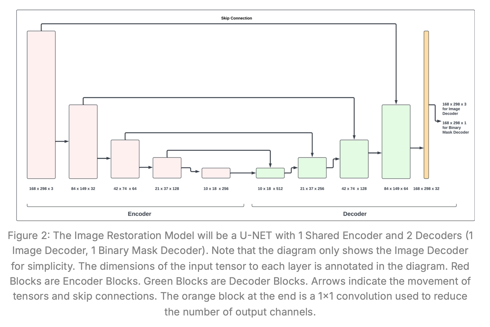
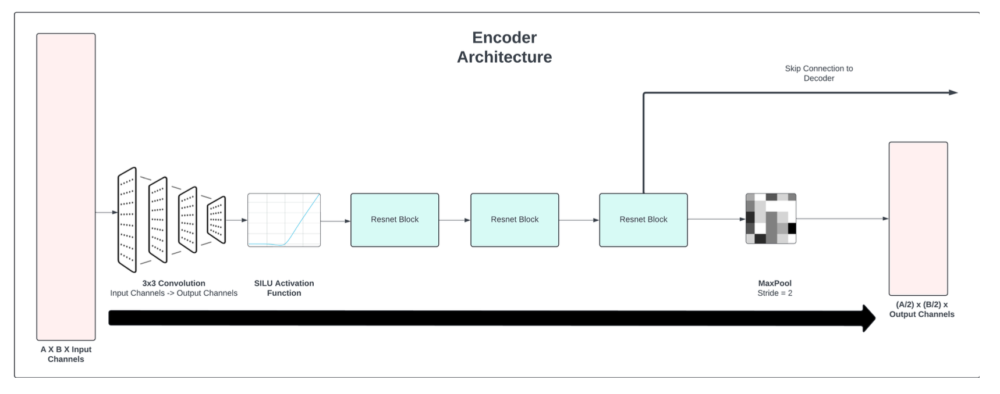
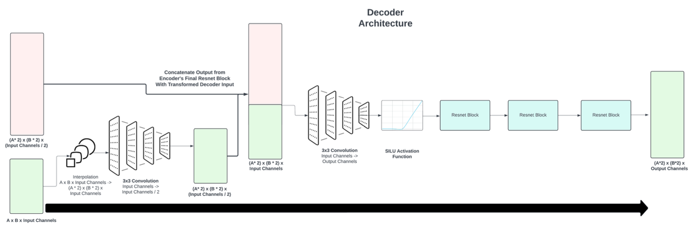
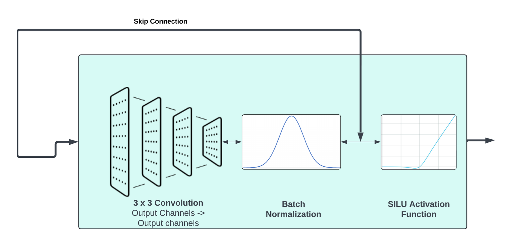

# Restore Corrupted Images (U-Net, Dual-Decoder)

A PyTorch implementation of an image restoration model that removes synthetic artifacts (random squares/circles) from images.  
The model is a **U-Net** with a **shared encoder** and **two decoders**:

- **Image Decoder**: predicts the clean (restored) RGB image.
- **Mask Decoder**: predicts a binary mask of corrupted regions.

At inference, the predicted mask is used to **composite** the final output by taking uncorrupted pixels from the input and corrupted pixels from the predicted image.

> Dataset used for development: ~30k paired samples (corrupted + clean) for training and ~25 samples for validation.

## Table of Contents

- [Key Ideas](#key-ideas)
- [Architecture](#architecture)
- [Reconstruction Logic](#reconstruction-logic)
- [Losses](#losses)
- [Normalization](#normalization)
- [Expected Training Behavior](#expected-training-behavior)
- [Project Structure](#project-structure)
- [Setup](#setup)
- [Data Preparation](#data-preparation)
- [Training](#training)
- [Validation & Outputs](#validation--outputs)
- [Tips](#tips)
- [Results (Example)](#results-example)
- [Citation](#citation)
- [License](#license)

## Key Ideas

- Predict **both** the restored image and the **corruption mask**.
- Use the predicted mask to **merge** the best parts:
  - keep original pixels where there’s **no** corruption
  - use model prediction where there **is** corruption
- Train with a composite loss that emphasizes accurate restoration **on the corrupted pixels** and **accurate mask prediction**.



## Architecture

**Backbone**: U-Net



- **Encoder (Downsampling path)**: repeated **ResNet-style blocks** → MaxPool.  
  

- **Decoder (Upsampling path)**: interpolation + convolutions with **skip connections** from corresponding encoder stages (taken **before** MaxPool).  
  

- **Heads**:
  - **Image Decoder** head: `1×1 conv → 3 channels → tanh` (outputs in [-1, 1])
  - **Mask Decoder** head: `1×1 conv → 1 channel → sigmoid` (outputs in [0, 1])

**ResNet Block (per stage)**:

1. 3×3 Conv
2. BatchNorm
3. Skip connection (elementwise sum with block input)
4. SiLU activation
   

## Reconstruction Logic

Let:

- $x \in \mathbb{R}^{M \times N \times 3}$ : clean image (ground truth)
- $\bar{x} \in \mathbb{R}^{M \times N \times 3}$ : corrupted input
- $\hat{x} \in \mathbb{R}^{M \times N \times 3}$ : Image Decoder prediction
- $m \in \{0,1\}^{M \times N}$ : ground-truth corruption mask
- $\hat{m} \in [0,1]^{M \times N}$ : Mask Decoder prediction

**Binarize** $\hat{m}$ at **0.1** for compositing & saving masks:

$$
\hat{m}_{bin} = \mathbf{1}[\hat{m} \geq 0.1]
$$

**Final reconstructed image**:

$$
x_{\text{recon}} = (1 - \hat{m}_{bin}) \odot \bar{x} + \hat{m}_{bin} \odot \hat{x}
$$

## Losses

Overall:

$$
\mathcal{L} = 2 \cdot \mathcal{L}_x + \mathcal{L}_m
$$

**Corrupted-Pixels Reconstruction Loss** (L1 on **corrupted** pixels only):

$$
\mathcal{L}_x = \frac{1}{|m|} \, \lVert ( \hat{x} - x ) \odot m \rVert_1
$$

where $|m|$ is the number of corrupted pixels.

**Mask Loss** (binary cross-entropy):

$$
\mathcal{L}_m = -\frac{1}{MN} \sum_{i=0}^{M-1}\sum_{j=0}^{N-1} \Big[ m_{ij}\log(\hat{m}_{ij}) + (1-m_{ij})\log(1-\hat{m}_{ij}) \Big]
$$

## Normalization

- **Model I/O**:

  - Image Decoder uses **tanh**, so predictions are in **[-1, 1]**.
  - Normalize **inputs** (clean & corrupted) to **[-1, 1]** before feeding the encoder.
  - **Un-normalize** predictions back to **0–255** for saving.

- Helpers (expected paths):
  - `data/img_utils.py` → `normalize(img)`, `unnormalize(img)`

## Training

- Train for ~**25 epochs** (reference).
- Mask predictions should become **near-perfect**.
- Reconstructed images should look correct for roughly **80–90%** of validation samples.
- When viewing predictions, the raw predicted image may include minor artifacts; the **mask-guided reconstruction** alleviates them.

## Setup

**Requirements**

- Python 3.10+
- PyTorch **2.2+**
- torchvision, numpy, pillow, tqdm, pyyaml (or equivalent)

**Install**

```bash
python -m venv .venv && source .venv/bin/activate
pip install -r requirements.txt
```

## Data Preparation

You need **paired samples**:

- `clean/xxxx.png` — original image
- `corrupted/xxxx.png` — same image with synthetic artifacts
- `mask/xxxx.png` — binary mask (1 = corrupted pixel, 0 = clean)

Organize as:

```
dataset/
  train/
    clean/
    corrupted/
    mask/
  val/
    clean/
    corrupted/
    mask/
```

Update paths in `configs/default.yaml` (or CLI args).

## Training

Example:

```bash
python run_train.py
```

## Validation & Outputs

After training:

```bash
python run_validation.py \
  --model_checkpoint ./checkpoints/best_model.pth \
  --data_dir ./data/val \
  --output_dir ./val_outputs
```

This script saves (per validation sample):

```
val_outputs/
  predicted_images/
  reconstructed_images/
  binary_masks/
```

- `binary_masks/` are **thresholded at 0.1**.
- `reconstructed_images/` are produced using the mask-guided compositing.

---

## Tips

- **Threshold**: The 0.1 mask threshold worked well in development; feel free to tune (e.g., 0.05–0.3).
- **Augmentations**: You can add flips/crops to improve robustness.
- **Loss Weights**: The `2 * Lx + Lm` weighting is a strong default; adjust if masks overfit or image quality lags.
- **Mixed Precision**: Use AMP (`torch.cuda.amp`) for speed/memory savings.
- **Early Stopping**: Monitor validation L1 on corrupted pixels and BCE on masks.

---

## Results (Example)

- **Epochs**: ~25
- **Mask**: near-perfect segmentation on validation
- **Reconstruction**: visually correct on ~80–90% of samples
- **Failure modes**: small color artifacts in `predicted_images/` that are largely fixed in `reconstructed_images/` via compositing.

---

## Citation

If you use or extend this work, consider citing the original U-Net paper:

- Ronneberger, Fischer, Brox. _U-Net: Convolutional Networks for Biomedical Image Segmentation_ (MICCAI 2015).

---

## License

MIT (or your choice). See `LICENSE`.
